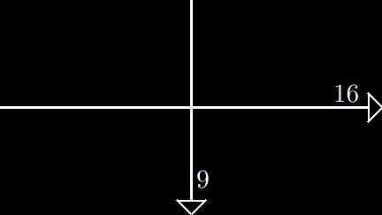
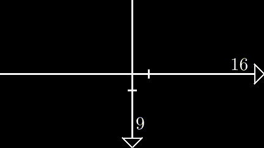
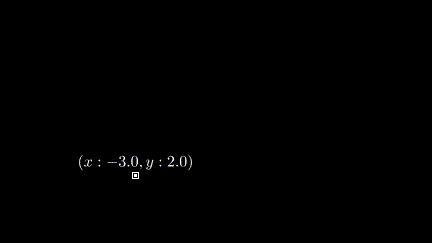
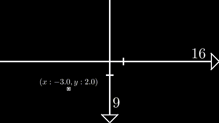

# The coordinate system

In this tutorial, we're going to build this animation:


## 1. Drawing the axes

We don't have a `Line` primitive, so we'll use very thin rectangles for lines.
Good enough!

---

The horizontal axis is drawn like this. It's just a static image, nothing fancy.
```py
from lanim.core import const_a
from lanim.pil import Align, Group, Latex, Rect, Triangle


def horizontal_axis(width):
    return Group([
        Rect(
            x=-0.3, y=0,
            width=width-0.6, height=0.04,
            line_width=2
        ),
        Triangle(
            x=width/2, y=0,
            dx1=0, dy1=0,
            dx2=-0.6, dy2=-0.6,
            dx3=-0.6, dy3=0.6,
            line_width=2
        ),
        Latex(
            x=6.5, y=-0.1, source=f"${width}$", scale_factor=0.75, align=Align.CD
        )
    ])


export = const_a(horizontal_axis(16))
```


In previous tutorials, we used some sort of "units" without any explanation.
Units are pretty simple: 1 unit equals 1/16th of the screen width. So if the dimensions
of your animation are 16:9, your canvas is 16 units wide and 9 units high.

The horizontal (`x`) axis points to the right, and the vertical axis (`y`) points down.
The center of the screen is the origin --- the point where `x` and `y` are both `0`.

---

The vertical axis is pretty much the same.
```py hl_lines="25-51"
from lanim.core import const_a
from lanim.pil import Align, Group, Latex, Rect, Triangle


def horizontal_axis(width):
    return Group([
        Rect(
            x=-0.3, y=0,
            width=width-0.6, height=0.04,
            line_width=2
        ),
        Triangle(
            x=width/2, y=0,
            dx1=0, dy1=0,
            dx2=-0.6, dy2=-0.6,
            dx3=-0.6, dy3=0.6,
            line_width=2
        ),
        Latex(
            x=6.5, y=-0.1, source=f"${width}$", scale_factor=0.75, align=Align.CD
        )
    ])


def vertical_axis(height):
    return Group([
        Rect(
            x=0, y=-0.3,
            width=0.04, height=height-0.6,
            line_width=2
        ),
        Triangle(
            x=0, y=height/2,
            dx1=0, dy1=0,
            dx2=-0.6, dy2=-0.6,
            dx3=0.6, dy3=-0.6,
            line_width=2
        ),
        Latex(
            x=0.1, y=3, source=f"${height}$", scale_factor=0.75, align=Align.LC
        )
    ])


axes = Group([
    horizontal_axis(16),
    vertical_axis(9)
])


export = const_a(axes)
```




---

Now we'll add notches where the `1` mark is
```py hl_lines="50-60"
from lanim.core import const_a
from lanim.pil import Align, Group, Latex, Rect, Triangle


def horizontal_axis(width):
    return Group([
        Rect(
            x=-0.3, y=0,
            width=width-0.6, height=0.04,
            line_width=2
        ),
        Triangle(
            x=width/2, y=0,
            dx1=0, dy1=0,
            dx2=-0.6, dy2=-0.6,
            dx3=-0.6, dy3=0.6,
            line_width=2
        ),
        Latex(
            x=6.5, y=-0.1, source=f"${width}$", scale_factor=0.75, align=Align.CD
        )
    ])


def vertical_axis(height):
    return Group([
        Rect(
            x=0, y=-0.3,
            width=0.04, height=height-0.6,
            line_width=2
        ),
        Triangle(
            x=0, y=height/2,
            dx1=0, dy1=0,
            dx2=-0.6, dy2=-0.6,
            dx3=0.6, dy3=-0.6,
            line_width=2
        ),
        Latex(
            x=0.1, y=3, source=f"${height}$", scale_factor=0.75, align=Align.LC
        )
    ])


axes = Group([
    horizontal_axis(16),
    vertical_axis(9)
])

notches = Group([
    Rect(x=1, y=0, width=0.05, height=0.5, line_width=2),
    Rect(x=0, y=1, width=0.5, height=0.05, line_width=2),
])

export = const_a(Group([axes, notches]))
```




## 2. Animating the point

Let's make a function `moving_point(x1, y1, x2, y2)` that returns an animation

This is what it's going to look like:

```py
def moving_point(x1, y1, x2, y2):
    def projector(t):
        return Group([...])
    return Animation(1, projector)
```

---

`(x, y)` represents the point we're currently drawing

```py hl_lines="3-4"
def moving_point(x1, y1, x2, y2):
    def projector(t):
        x = x1*(1 - t) + x2*t
        y = y1*(1 - t) + y2*t
        latex = f"$(x:{x:.1f}, y:{y:.1f})$"
        return Group([
            Rect(x, y, 0.05, 0.05, line_width=2),
            Rect(x, y, 0.25, 0.25, line_width=0.7),
            Latex(x, y-0.1, latex, align=Align.CD).scaled(0.4),
        ])
    return Animation(1, projector)
```

`latex` stores a formatter LaTeX string, like `$(x:5.0, y:-3.0)$`.

```py hl_lines="5"
def moving_point(x1, y1, x2, y2):
    def projector(t):
        x = x1*(1 - t) + x2*t
        y = y1*(1 - t) + y2*t
        latex = f"$(x:{x:.1f}, y:{y:.1f})$"
        return Group([
            Rect(x, y, 0.05, 0.05, line_width=2),
            Rect(x, y, 0.25, 0.25, line_width=0.7),
            Latex(x, y-0.1, latex, align=Align.CD).scaled(0.4),
        ])
    return Animation(1, projector)
```

We return a bundle of:

- the inner square
- the outer square
- a `Latex` object with the label

```py hl_lines="7-9"
def moving_point(x1, y1, x2, y2):
    def projector(t):
        x = x1*(1 - t) + x2*t
        y = y1*(1 - t) + y2*t
        latex = f"$(x:{x:.1f}, y:{y:.1f})$"
        return Group([
            Rect(x, y, 0.05, 0.05, line_width=2),
            Rect(x, y, 0.25, 0.25, line_width=0.7),
            Latex(x, y-0.1, latex, align=Align.CD).scaled(0.4),
        ])
    return Animation(1, projector)
```

---

Now let's see it in action.

```py hl_lines="1-3 19"
from lanim.core import Animation
from lanim.pil import Align, Group, Latex, Rect
from lanim.easings import in_out


def moving_point(x1, y1, x2, y2):
    def projector(t):
        x = x1*(1 - t) + x2*t
        y = y1*(1 - t) + y2*t
        latex = f"$(x:{x:.1f}, y:{y:.1f})$"
        return Group([
            Rect(x, y, 0.05, 0.05, line_width=2),
            Rect(x, y, 0.25, 0.25, line_width=0.7),
            Latex(x, y-0.1, latex, align=Align.CD).scaled(0.4),
        ])
    return Animation(1, projector)


export = moving_point(x1=-3, y1=2, x2=5, y2=-3).ease(in_out) * 6
```



---

Let's make the point go around in a loop.

```py
export = (
      moving_point(x1=-3, y1=2, x2=5, y2=-3).ease(in_out) * 6
    + moving_point(x1=5, y1=-3, x2=-4, y2=-3).ease(in_out) * 4
    + moving_point(x1=-4, y1=-3, x2=-3, y2=2).ease(in_out) * 4
)
```


---

If you have lots of animations, it can be inconvenient to use `+`.
You can use the `seq_a` function, which essentially runs `+` on a list of animations.

```py
from lanim.core import Animation, seq_a

...

export = seq_a(
    moving_point(x1=-3, y1=2, x2=5, y2=-3).ease(in_out) * 6,
    moving_point(x1=5, y1=-3, x2=-4, y2=-3).ease(in_out) * 4,
    moving_point(x1=-4, y1=-3, x2=-3, y2=2).ease(in_out) * 4,
)
```

## 3. Combining the animations


Let's rename the export of the previous animation to `point_animation`.


??? quote  All the code so far

    ```py
    from lanim.core import Animation, seq_a, const_a
    from lanim.pil import Align, Group, Latex, Rect, Triangle
    from lanim.easings import in_out


    def horizontal_axis(width):
        return Group([
            Rect(
                x=-0.3, y=0,
                width=width-0.6, height=0.04,
                line_width=2
            ),
            Triangle(
                x=width/2, y=0,
                dx1=0, dy1=0,
                dx2=-0.6, dy2=-0.6,
                dx3=-0.6, dy3=0.6,
                line_width=2
            ),
            Latex(
                x=6.5, y=-0.1, source=f"${width}$", scale_factor=0.75, align=Align.CD
            )
        ])


    def vertical_axis(height):
        return Group([
            Rect(
                x=0, y=-0.3,
                width=0.04, height=height-0.6,
                line_width=2
            ),
            Triangle(
                x=0, y=height/2,
                dx1=0, dy1=0,
                dx2=-0.6, dy2=-0.6,
                dx3=0.6, dy3=-0.6,
                line_width=2
            ),
            Latex(
                x=0.1, y=3, source=f"${height}$", scale_factor=0.75, align=Align.LC
            )
        ])


    def moving_point(x1, y1, x2, y2):
        def projector(t):
            x = x1*(1 - t) + x2*t
            y = y1*(1 - t) + y2*t
            latex = f"$(x:{x:.1f}, y:{y:.1f})$"
            return Group([
                Rect(x, y, 0.05, 0.05, line_width=2),
                Rect(x, y, 0.25, 0.25, line_width=0.7),
                Latex(x, y-0.1, latex, align=Align.CD).scaled(0.4),
            ])
        return Animation(1, projector)


    #---------------------------------------#


    axes = Group([
        horizontal_axis(16),
        vertical_axis(9)
    ])

    notches = Group([
        Rect(x=1, y=0, width=0.05, height=0.5, line_width=2),
        Rect(x=0, y=1, width=0.5, height=0.05, line_width=2),
    ])


    point_animation = seq_a(
        moving_point(x1=-3, y1=2, x2=5, y2=-3).ease(in_out) * 6,
        moving_point(x1=5, y1=-3, x2=-4, y2=-3).ease(in_out) * 4,
        moving_point(x1=-4, y1=-3, x2=-3, y2=2).ease(in_out) * 4,
    )


    export = const_a(Group([axes, notches]))
    ```

What we need to do know is to make an animation which will play
the `point_animation` but place `axes` and `notches` in the background, so to speak.

We will do it in three ways: a low-level one, a high-level one and finally
using a built-in function.

### 3.1. The low-level way

```py
def total_projector(t):
    return Group([
        axes,
        notches,
        point_animation.projector(t)
    ])
export = Animation(point_animation.duration, total_projector)
```

In this approach, we follow the requirements quite literally. For each value of
`t`, we return a bundle of the axes, the notches and a frame of our dynamic
animation.

It works!



But it's pretty long, and we have to make sure we supply the correct
duration to `Animation`.


### 3.2. The high-level way

Animations have a `map` method. It allows you to apply a function to
each frame of the animation.

```py
export = point_animation.map(lambda point: Group([axes, notches, point]))
```

A more advanced solution would be to use a bound method:
```py
export = point_animation.map(Group([axes, notches]).add)
```


### 3.3.  The built-in `gbackground`

`lanim` provides a built-in function to express adding a static background:

```py
from lanim.pil import gbackground

...

export = gbackground(point_animation, [axes, notches])
```


## 4. Adding a delay

Use the `pause_after` and `pause_before` functions to freeze for a given
amount of seconds before the start or after the end of an animation.
```py hl_lines="1 6"
from lanim.core import Animation, pause_after, pause_before, seq_a

...

export = gbackground(point_animation, [axes, notches])
export = pause_after(pause_before(export, 2), 2)
```

Try implementing these functions yourself as an exercise!


??? quote "The final program"

    ```py
    from lanim.pil import gbackground, Align, Group, Latex, Rect, Triangle
    from lanim.core import Animation, pause_after, pause_before, seq_a
    from lanim.easings import in_out


    def horizontal_axis(width):
        return Group([
            Rect(
                x=-0.3, y=0,
                width=width-0.6, height=0.04,
                line_width=2
            ),
            Triangle(
                x=width/2, y=0,
                dx1=0, dy1=0,
                dx2=-0.6, dy2=-0.6,
                dx3=-0.6, dy3=0.6,
                line_width=2
            ),
            Latex(
                x=6.5, y=-0.1, source=f"${width}$", scale_factor=0.75, align=Align.CD
            )
        ])


    def vertical_axis(height):
        return Group([
            Rect(
                x=0, y=-0.3,
                width=0.04, height=height-0.6,
                line_width=2
            ),
            Triangle(
                x=0, y=height/2,
                dx1=0, dy1=0,
                dx2=-0.6, dy2=-0.6,
                dx3=0.6, dy3=-0.6,
                line_width=2
            ),
            Latex(
                x=0.1, y=3, source=f"${height}$", scale_factor=0.75, align=Align.LC
            )
        ])


    def moving_point(x1, y1, x2, y2):
        def projector(t):
            x = x1*(1 - t) + x2*t
            y = y1*(1 - t) + y2*t
            latex = f"$(x:{x:.1f}, y:{y:.1f})$"
            return Group([
                Rect(x, y, 0.05, 0.05, line_width=2),
                Rect(x, y, 0.25, 0.25, line_width=0.7),
                Latex(x, y-0.1, latex, align=Align.CD).scaled(0.4),
            ])
        return Animation(1, projector)


    #---------------------------------------#


    axes = Group([
        horizontal_axis(16),
        vertical_axis(9)
    ])

    notches = Group([
        Rect(x=1, y=0, width=0.05, height=0.5, line_width=2),
        Rect(x=0, y=1, width=0.5, height=0.05, line_width=2),
    ])

    point_animation = seq_a(
        moving_point(x1=-3, y1=2, x2=5, y2=-3).ease(in_out) * 6,
        moving_point(x1=5, y1=-3, x2=-4, y2=-3).ease(in_out) * 4,
        moving_point(x1=-4, y1=-3, x2=-3, y2=2).ease(in_out) * 4,
    )

    export = gbackground(point_animation, [axes, notches])
    export = pause_after(pause_before(export, 2), 2)
    ```


## 5. Recap

In this tutorial:
- you've learned what coordinate system `lanim` uses
- you've learned how to combine a dynamic animation with a static background