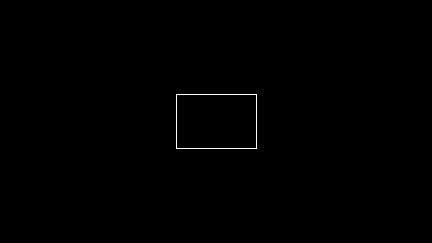
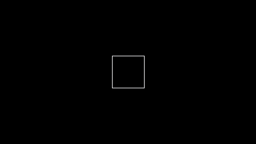
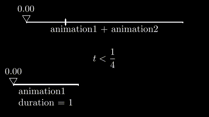
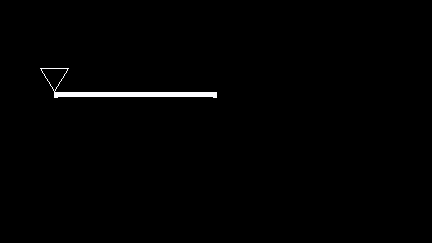

# How does Lanim work?

In this tutorial, we're going to create an animated slider.
You will learn how Lanim works under the hood along the way.


## 1. So what is an animation?

If you open [the source code of the `Animation` class](https://github.com/decorator-factory/lanim/blob/8839014/lanim/anim.py#L68)
and remove all the noise, this is what it is:

```py
class Animation(Generic[A]):
    duration: float
    projector: Callable[[float], A]
```

!!! note

    If you're not familiar with [type annotations](https://realpython.com/python-type-checking/)
    (the stuff after `:`), just ignore them.

An animation consists of a duration (in seconds) and some function.
We'll see what this function does in just a moment.


## 2. Let's write an animation from scratch

Type this code into a file, e.g. `how_does.py`:
```py
from lanim.core import Animation
from lanim.pil import Rect


def projector(t):
    return Rect(x=0, y=0, width=3, height=2 + t*4)

export = Animation(duration=5.0, projector=projector)
```
Then run it the usual way:
`python -m lanim -o how_does.mp4 how_does`

You should see this:



The "projector" thing works as follows: `lanim` will call the `projector`
of an animation with increasing values of t: `0.0`, `0.01`, `0.02`, ..., and finally `1.0`.
While doing so, it records all the _frames_ (in this case, `Rect` objects) and
renders them as images with the `pillow` library.

That's it --- no tricks up my sleeve.


## 3. Using standard functions

```py
from lanim.core import Animation
from lanim.pil import Rect


def projector1(t):
    side = 2 + t*3
    return Rect(x=0, y=0, width=side, height=side)

animation1 = Animation(duration=1.0, projector=projector1)


def projector2(t):
    side = 5
    return Rect(x=t*4, y=0, width=side, height=side)

animation2 = Animation(duration=3.0, projector=projector2)


export = animation1 + animation2
```


The sum animation works in the same way: it receives a `t` ranging from 0 to 1, and it
returns something renderable. It does so by picking one of the animations and adjusting
the `t` value. For example, like this:
```py
def export_projector(t):
    if t < 1/4:
        local_t = t * 4
        return projector1(local_t)
    else:
        local_t = (t - 1/4) * (4/3)
        return projector2(local_t)

export = Animation(1.0 + 3.0, export_projector )
```

=== "Visualization"

    

=== "Code (advanced)"

    ```py
    from functools import reduce
    from lanim.core import Animation
    from lanim.pil import lrpair_longest, Align, Group, Latex, Rect, Triangle


    def slider(x1: float, x2: float, message: str, t: float):
        slider_xpos = x1*(1-t) + x2*t
        bar = Rect(
            x=(x1 + x2)/2, y=0,
            width=x2 - x1, height=0.03,
            line_width=2
        )

        pointer = Triangle(
            x=slider_xpos, y=-0.3,
            dx1=-0.3, dy1=-0.2,
            dx2=+0.3, dy2=-0.2,
            dx3=0,    dy3=+0.3
        )

        progress = Latex(
            x=slider_xpos, y=-0.7, source=f"${t:.2f}$", align=Align.CD
        ).scaled(0.5)

        sign = Latex(
            x=(x1 + x2)/2, y=0.2,
            source=message, align=Align.CU
        ).scaled(0.5)

        return Group([bar, pointer, progress, sign])


    def big_slider(t: float):
        slider_ = slider(-6, 6, "animation1 + animation2", t).moved(dx=0, dy=-2.8)
        notch = Rect(x=-3, y=-2.8, width=0.02, height=0.55, line_width=2)

        return Group([slider_, notch])


    def left_slider(t: float):
        return slider(-7, -2, "animation1\n\nduration = 1", t).moved(dx=0, dy=2)


    def right_slider(t: float):
        return slider(2, 7, "animation2\n\nduration = 3", t).moved(dx=0, dy=2)


    def total_slider(t: float):
        if t < 1/4:
            return left_slider(t*4)
        else:
            return right_slider((t - 1/4) * (4/3))


    def conditional(t: float):
        if t < 1/4:
            return Latex(x=0, y=0, source=r"$t < \dfrac{1}{4}$").scaled(0.5)
        else:
            return Latex(x=0, y=0, source=r"$t \ge \dfrac{1}{4}$").scaled(0.5)


    export = reduce(lrpair_longest, (
        Animation(10, total_slider),
        Animation(10, big_slider),
        Animation(10, conditional),
    ))
    ```

With some simple maths, you can do what `+` does like so:

```py
def plus(animation1, animation2):
    total_duration = animation1.duration + animation2.duration
    ratio = animation1.duration / total_duration

    def projector(t):
        if t < ratio:
            return animation1.projector(t / ratio)
        else:
            return animation2.projector((t - ratio) / (1 - ratio))

    return Animation(total_duration, projector)
```


## 4. Making the slider

At the start, I promised that we're going to make a slider animation.

A slider will consist of two things: a bar and a triangle that moves along that bar.

We'll make a function that accepts some parameters and returns a `Pair` object.

---

Here, `x` and `y` are the center of our slider, `width` is the width of the slider,
and `t` is the progress --- a value from 0 to 1 that tells where on the slider
the triangle should be.
```py hl_lines="4"
from lanim.pil import Pair, Rect, Triangle


def make_slider(x, y, width, t):
    bar = Rect(x=x, y=y, width=width, height=0.05, line_width=4)
    triangle = Triangle(
        x=x - width/2 + t*width, y=y-0.6,

        dx1=-0.5, dy1=-0.35,
        dx2=0.5,  dy2=-0.35,
        dx3=0,    dy3=0.5,
    )
    return Pair(bar, triangle)
```

---

For the bar, we'll use a very thin rectangle with a big line thickness.
```py hl_lines="5"
from lanim.pil import Pair, Rect, Triangle


def make_slider(x, y, width, t):
    bar = Rect(x=x, y=y, width=width, height=0.05, line_width=4)
    triangle = Triangle(
        x=x - width/2 + t*width, y=y-0.6,

        dx1=-0.5, dy1=-0.35,
        dx2=0.5,  dy2=-0.35,
        dx3=0,    dy3=0.5,
    )
    return Pair(bar, triangle)
```

---

The `Triangle` class accepts the starting position `(x, y)` and three pairs
`(dx1, dy1)`, `(dx2, dy2)`, `(dx3, dy3)` telling how far apart each of the
three points is from `(x, y)`.

For the `x` position, we will choose a value that depends on `t`. This is what's
going to make the slide animated.
```py hl_lines="6-12"
from lanim.pil import Pair, Rect, Triangle


def make_slider(x, y, width, t):
    bar = Rect(x=x, y=y, width=width, height=0.05, line_width=4)
    triangle = Triangle(
        x=x - width/2 + t*width, y=y-0.6,

        dx1=-0.5, dy1=-0.35,
        dx2=0.5,  dy2=-0.35,
        dx3=0,    dy3=0.5,
    )
    return Pair(bar, triangle)
```

---

Finally, we bundle the bar and the triangle into a pair and return it.

```py hl_lines="13"
from lanim.pil import Pair, Rect, Triangle


def make_slider(x, y, width, t):
    bar = Rect(x=x, y=y, width=width, height=0.05, line_width=4)
    triangle = Triangle(
        x=x - width/2 + t*width, y=y-0.6,

        dx1=-0.5, dy1=-0.35,
        dx2=0.5,  dy2=-0.35,
        dx3=0,    dy3=0.5,
    )
    return Pair(bar, triangle)
```

## 5. Testing the slider

Let's make a helper function that will act the _projector_.
Then you can run the animation.

```py hl_lines="1 17-22"
from lanim.core import Animation
from lanim.pil import Pair, Rect, Triangle


def make_slider(x, y, width, t):
    bar = Rect(x=x, y=y, width=width, height=0.05, line_width=4)
    triangle = Triangle(
        x=x - width/2 + t*width, y=y-0.6,

        dx1=-0.5, dy1=-0.35,
        dx2=0.5,  dy2=-0.35,
        dx3=0,    dy3=0.5,
    )
    return Pair(bar, triangle)


def projector(t):
    return make_slider(x=-3, y=-1, width=6, t=t)


export = Animation(6.0, projector)
```




## 6. Attaching a number to the triangle

In the previous animation, the slider had a varying number attached to it.
Let's implement that as well.

First, let's extract the x-coordinate of the slider into a variable.
```py hl_lines="4 6"
def make_slider(x, y, width, t):
    bar = Rect(x=x, y=y, width=width, height=0.05, line_width=4)

    slider_xpos = x - width/2 + t*width

    triangle = Triangle(
        x=slider_xpos, y=y-0.6,

        dx1=-0.5, dy1=-0.35,
        dx2=0.5,  dy2=-0.35,
        dx3=0,    dy3=0.5,
    )
    return Pair(bar, triangle)
```

Then, let's add a `Latex` object with the number we want. The `:.2f` modifier
formats a `float` with two decimal places.
```py hl_lines="6"
def make_slider(x, y, width, t):
    bar = Rect(x=x, y=y, width=width, height=0.05, line_width=4)

    slider_xpos = x - width/2 + t*width

    label = Latex(x=slider_xpos, y=y+0.5, source=f"${t:.2f}$").scaled(0.5)

    triangle = Triangle(
        x=slider_xpos, y=y-0.6,

        dx1=-0.5, dy1=-0.35,
        dx2=0.5,  dy2=-0.35,
        dx3=0,    dy3=0.5,
    )
    return Pair(bar, triangle)
```

Here's the issue: a pair only accepts two values, but we need three.
```py hl_lines="17"
from lanim.pil import Pair, Rect, Triangle, Latex

def make_slider(x, y, width, t):
    bar = Rect(x=x, y=y, width=width, height=0.05, line_width=4)

    slider_xpos = x - width/2 + t*width

    label = Latex(x=slider_xpos, y=y+0.5, source=f"${t:.2f}$").scaled(0.5)

    triangle = Triangle(
        x=slider_xpos, y=y-0.6,

        dx1=-0.5, dy1=-0.35,
        dx2=0.5,  dy2=-0.35,
        dx3=0,    dy3=0.5,
    )
    return Pair(bar, triangle)
```

Solution: place the pair inside another pair
```py hl_lines="15"
def make_slider(x, y, width, t):
    bar = Rect(x=x, y=y, width=width, height=0.05, line_width=4)

    slider_xpos = x - width/2 + t*width

    label = Latex(x=slider_xpos, y=y+0.5, source=f"${t:.2f}$").scaled(0.5)

    triangle = Triangle(
        x=slider_xpos, y=y-0.6,

        dx1=-0.5, dy1=-0.35,
        dx2=0.5,  dy2=-0.35,
        dx3=0,    dy3=0.5,
    )
    return Pair(label, Pair(bar, triangle))
```

Now let's run the code:

??? quote "The code so far"

    ```py
    from lanim.core import Animation
    from lanim.pil import Pair, Rect, Triangle, Latex


    def make_slider(x, y, width, t):
        bar = Rect(x=x, y=y, width=width, height=0.05, line_width=4)

        slider_xpos = x - width/2 + t*width

        label = Latex(x=slider_xpos, y=y+0.5, source=f"${t:.2f}$").scaled(0.5)

        triangle = Triangle(
            x=slider_xpos, y=y-0.6,

            dx1=-0.5, dy1=-0.35,
            dx2=0.5,  dy2=-0.35,
            dx3=0,    dy3=0.5,
        )
        return Pair(label, Pair(bar, triangle))

    def projector(t):
        return make_slider(x=-3, y=-1, width=6, t=t)


    export = Animation(6.0, projector)
    ```


## 7. Using a `Group`

If you have more than 2 or 3 elements, nested pairs become inconvenient.
`Group` is a generalization of `Pair` --- it can hold any number of elements

```py hl_lines="15"
def make_slider(x, y, width, t):
    bar = Rect(x=x, y=y, width=width, height=0.05, line_width=4)

    slider_xpos = x - width/2 + t*width

    label = Latex(x=slider_xpos, y=y+0.5, source=f"${t:.2f}$").scaled(0.5)

    triangle = Triangle(
        x=slider_xpos, y=y-0.6,

        dx1=-0.5, dy1=-0.35,
        dx2=0.5,  dy2=-0.35,
        dx3=0,    dy3=0.5,
    )
    return Group([bar, label, triangle])
```

## Recap

Now you know that:

1. An animation consists of a duration and a projector
2. A projector is a function taking a number from 0 to 1 and returning an animation frame

And now you can:

1. Write an animation by constructing an `Animation` object yourself
2. Animate a structure made up of multiple elements
